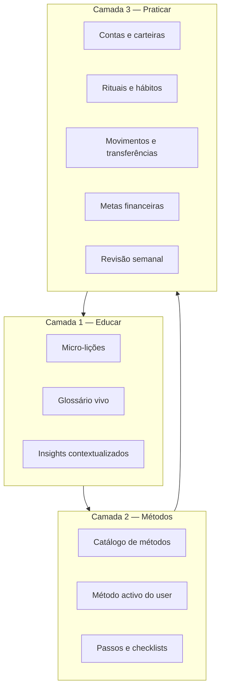
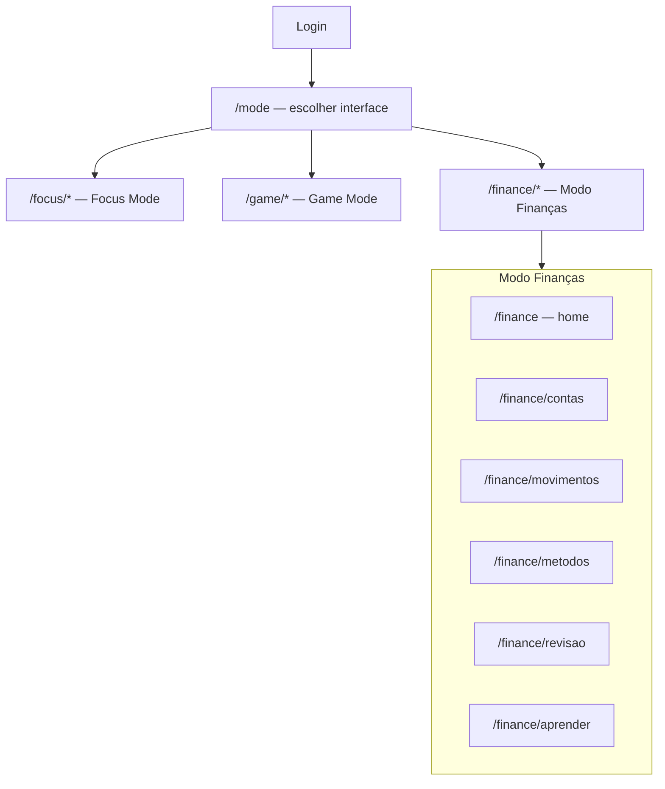

# LifeOS — Módulo Financeiro (desenho)

**Versão:** 1.0 · **Estado:** F1.0 implementado (backend + UI)  
**Última actualização:** 2026-05-30

> **Posicionamento:** não é um banco nem um clone de Mint/YNAB.  
> É um **sistema de educação financeira prática** dentro do LifeOS — métodos guiados, hábitos, reflexão, **contas e movimentos** para **aprender a gerir dinheiro enquanto se gere**.

Relacionado: [`MODULOS-FUTUROS.md`](MODULOS-FUTUROS.md) · [`LIFEOS-RPG.md`](LIFEOS-RPG.md) · [`ROADMAP.md`](ROADMAP.md) · **Manual:** [`MANUAL-FINANCEIRO.md`](MANUAL-FINANCEIRO.md)

---

## 1. Filosofia

| ❌ Não somos | ✅ Somos |
|-------------|---------|
| App de contabilidade completa | **Coach de literacia financeira** integrado na vida |
| Dashboards só com números | **Métodos** que explicam *porquê* e *como* |
| Import bancário automático como requisito | **Contas manuais** desde o MVP + sync bancário só no futuro |
| Conselhos genéricos | Caminhos **personalizados** ao perfil e objectivos do user |
| Finanças isoladas do resto da vida | Finanças ligadas a **hábitos**, **objectivos**, **Game Mode** e **Case** |

### Princípios de produto

1. **Educar antes de controlar** — cada ecrã ensina um conceito (ex.: «fundo de emergência», «taxa de poupança»).
2. **Método > ferramenta** — o user escolhe ou recebe um **método** (50/30/20, envelopes, «paga-te a ti primeiro»); a app guia a execução.
3. **Pequenos passos** — micro-acções diárias/semanais, não onboarding de 40 campos.
4. **Sem vergonha** — linguagem neutra, progresso por consistência, não por saldo.
5. **Privacidade total** — dados financeiros só do user; nunca partilhados em Enterprise sem opt-in explícito (futuro).

### Frase de produto

**«Aprende a tratar o teu dinheiro como tratas o teu tempo — com método, hábito e clareza.»**

---

## 2. Para quem

| Perfil | Dor | O que o módulo oferece |
|--------|-----|------------------------|
| **Iniciante** | Não sabe por onde começar | Trilho «Primeiros 30 dias» + método simples (50/30/20) |
| **Organizado mas ansioso** | Regista mas não muda comportamento | Rituais, reflexão, metas com significado |
| **Freelancer / negócio pessoal** | Receita irregular | Método «Renda variável» + ligação **CLIENTS** |
| **Já poupa** | Quer optimizar | Métodos avançados (snowball, investimento introdutório) |
| **Modo Game** | Quer motivação extra | Missões financeiras, atributo **Finanças** por comportamento real |

---

## 3. Arquitectura conceptual — três camadas



| Camada | Função | Exemplos |
|--------|--------|----------|
| **Educar** | Compreensão | «O que é juro composto?», tooltips, cards de 2 min |
| **Métodos** | Estrutura reutilizável | 50/30/20, fundo de emergência, bola de neve |
| **Praticar** | Acção no mundo real | Criar contas, registar despesa, transferir poupança, ritual domingo |

**Fluxo típico:** onboarding curto → escolher (ou ser sugerido) um **método** → seguir **passos** com **micro-lições** → **praticar** com registo mínimo e **rituais** → **revisão semanal** gera insight → loop.

---

## 4. O coração do produto — **Métodos**

Um **Método** é um programa guiado: nome, descrição, nível, duração, passos sequenciais, hábitos sugeridos, métricas de sucesso e lições associadas.

### Anatomia de um Método

```
Método
├── id, nome, tagline
├── nível: iniciante | intermédio | avançado
├── duração: dias | semanas | contínuo
├── objectivo educacional (1 frase)
├── passos[] — ordem, título, descrição, acção na app, lição opcional
├── hábitos sugeridos[] — templates para base HABITS
├── métricas[] — o que medir (ex.: taxa poupança, dias de revisão)
└── pré-requisitos[] — outros métodos ou dados mínimos
```

### Catálogo inicial (MVP+)

Ver **Anexo A** para lista completa. Destaques:

| Método | Ideia central | Porquê educativo |
|--------|---------------|------------------|
| **Primeiros 30 dias** | Onboarding financeiro | Hábitos base antes de números complexos |
| **50/30/20** | Necessidades / desejos / poupança | Framework simples e memorável |
| **Paga-te a ti primeiro** | Poupar antes de gastar | Inverte a mentalidade «sobra no fim» |
| **Fundo de emergência** | 1→3→6 meses de despesas | Prioriza segurança antes de investir |
| **Envelopes** | Orçamento por categorias com tecto | Consciência por «bolso mental» |
| **Renda variável** | Base + pico + fundo mês fraco | Para freelancers; liga **CLIENTS** |
| **Bola de neve / Avalanche** | Estratégias de dívida | Ensina trade-offs matemático vs motivação |
| **Revisão semanal** | Ritual fixo (15 min) | Consistência > perfeição contabilística |

### Sugestão inteligente de método

Questionário curto (6 perguntas) no primeiro acesso:

1. Tens dívidas com juro alto? → Avalanche ou Snowball  
2. Renda fixa ou variável? → 50/30/20 vs Renda variável  
3. Já tens fundo de emergência? → Se não, Emergency Fund primeiro  
4. Quanto tempo podes dedicar por semana? → Primeiros 30 dias vs só Revisão semanal  
5. Queres ligação ao Game Mode? → Missões financeiras activadas  
6. Objectivos nos próximos 3 meses? → Pagar dívida / poupar / organizar (desempata a sugestão)  

---

## 5. Pilares de educação financeira

Conteúdo organizado em **6 pilares** — cada método toca 1+ pilares; micro-lições mapeiam aqui.

| Pilar | Competências | Métodos relacionados |
|-------|--------------|----------------------|
| **Consciência** | Saber quanto entra, sai e onde vai | Primeiros 30 dias, Revisão semanal |
| **Orçamento** | Planear antes de gastar | 50/30/20, Envelopes |
| **Poupança** | Reserva, metas, automatismo | Paga-te a ti primeiro, Fundo emergência |
| **Dívida** | Juros, priorização, negociação | Snowball, Avalanche |
| **Protecção** | Seguros, colchão, risco | Fundo emergência |
| **Crescimento** | Investimento intro, inflação, tempo | Intro investimento (fase posterior) |

Cada **micro-lição** = 1 conceito, ≤ 120 palavras, 1 exemplo PT, 1 acção opcional na app.

---

## 6. Experiência de utilizador (desenho)

### Onde vive no LifeOS

**Decisão:** o Modo Finanças é uma **interface de topo**, ao mesmo nível que Focus e Game — escolhida em **`/mode`** após login, não como secção dentro do Focus.



| Modo | Rota base | Cor / identidade | Papel |
|------|-----------|------------------|--------|
| **Focus** | `/focus` | Esmeralda | Produtividade, workspaces, bases |
| **Game** | `/game` | Violeta | RPG, XP, missões |
| **Finanças** | `/finance` | Âmbar | Educação financeira + contas |

**Trocar modo:** sidebar «Trocar modo» ou ⌘K → volta a **`/mode`**.  
`activeMode` em localStorage: `"focus" | "game" | "finance"`.

Motivo: métodos, trilhos e rituais financeiros merecem **shell dedicada** (como Game), sem competir com a sidebar de workspaces.

### Ecrãs principais (wireframe conceptual)

#### 6.1 Home `/finance`

- **Património** — saldo total (contas − dívidas) com breakdown por conta
- **Contas** — cards com saldo actual (cor, ícone, tipo)
- **Método activo** — progresso, próximo passo, CTA «Continuar»
- **Resumo do mês** — entradas, saídas, poupança % (agregado de todas as contas)
- **Ritual pendente** — «Revisão semanal — falta 2 dias»
- **Insight da semana** — 1 frase educativa baseada nos dados (rule-based no MVP)
- **Atalhos** — «+ Despesa», «+ Receita», «⇄ Transferir»

#### 6.2 Catálogo de métodos

- Filtro por nível e pilar
- Card: nome, duração, «X utilizadores completaram» (futuro social opt-in)
- Detalhe: passos preview, hábitos que cria, pré-requisitos

#### 6.3 Método activo

- Timeline vertical de passos (feito / actual / bloqueado)
- Cada passo: texto educativo + botão acção («Registar 3 despesas», «Criar meta»)
- Barra de progresso do método + celebração ao concluir passo (toast Focus, opcional XP Game)

#### 6.4 Revisão semanal (ritual)

Fluxo guiado ~15 min, ecrã a ecrã:

1. Quanto entrou esta semana?  
2. Quanto saiu? (top 3 categorias)  
3. Fiquei dentro do método? (sim / parcial / não — sem julgamento)  
4. Uma coisa a melhorar na próxima semana (texto livre)  
5. Micro-lição + resumo guardado  

Integração: pode ser **hábito** «Revisão financeira» (Área RPG: Finanças). Inclui passo **«Conferir saldos»** — comparar saldo registado vs expectativa por conta.

#### 6.5 Contas e carteiras

Secção **`/finance/contas`** — coração operacional do módulo (junto com métodos educativos).

**Tipos de conta (enum):**

| Tipo | Exemplos | Saldo | Uso educativo |
|------|----------|-------|---------------|
| `CHECKING` | Conta à ordem, MB Way «bolso principal» | ≥ 0 | Onde entra salário e saem despesas do dia-a-dia |
| `SAVINGS` | Poupança, depósito a prazo | ≥ 0 | Fundo emergência, metas — lição «separar do corrente» |
| `CASH` | Dinheiro físico | ≥ 0 | Consciência de gastos em numerário |
| `CREDIT_CARD` | Cartão crédito | ≤ 0 (dívida) | Ensinar ciclo de facturação e limite |
| `INVESTMENT` | Corretora, PPR (manual) | ≥ 0 | Fase avançada — intro investimento |
| `LOAN` | Crédito pessoal, automóvel | ≤ 0 | Métodos Snowball / Avalanche |
| `OTHER` | Vale refeição, conta conjunta manual | variável | Flexibilidade |

**Campos por conta:**

- Nome (ex.: «CGD Ordem», «Revolut»)
- Tipo, moeda (EUR default), cor + ícone
- Saldo inicial + data de referência (para quem migra saldos existentes)
- Saldo actual (**calculado** a partir de movimentos + saldo inicial)
- Opcional: instituição (texto), últimos 4 dígitos / IBAN parcial (só referência visual — **nunca** credenciais)
- Flag `isArchived`, `includeInNetWorth`
- Conta **por defeito** para despesas / receitas / poupança (1 cada)

**Ecrã lista de contas:**

- Card por conta: nome, tipo, saldo, variação mês
- Total património líquido no topo
- CTA «Adicionar conta» — wizard curto (tipo → nome → saldo inicial)

**Ecrã detalhe da conta:**

- Saldo + gráfico evolução 30/90 dias
- Lista de movimentos filtrada
- Acções: editar, arquivar, ajuste de saldo (com lição explicativa)

**Ajuste de saldo (reconciliação):**

Quando o saldo real ≠ saldo calculado, o user cria um movimento tipo `ADJUSTMENT` com nota obrigatória.  
Micro-lição: «Pequenos desvios são normais — o importante é corrigir e perceber porquê.»

#### 6.6 Movimentos e transferências

Secção **`/finance/movimentos`**.

**Tipos de movimento:**

| Tipo | Efeito | Campos |
|------|--------|--------|
| `EXPENSE` | − valor na conta | conta, categoria, valor, data, nota |
| `INCOME` | + valor na conta | conta, categoria, valor, data, nota |
| `TRANSFER` | − origem, + destino (mesmo valor) | conta origem, conta destino, valor, data, nota |
| `ADJUSTMENT` | corrige saldo | conta, delta, data, motivo |

**Regras:**

- Todo movimento pertence a **pelo menos uma conta**
- Transferências **não** contam como despesa/receita no resumo mensal (evita double-count)
- Categorias aplicam-se a EXPENSE/INCOME; transferências para poupança podem ter tag «Poupança automática»
- Despesa rápida: modal com conta por defeito + últimas categorias

**Ligação CLIENTS:**

- Deal **Fechado** → sugestão: «Registar receita de €X» com conta e categoria pré-preenchidas

#### 6.7 Aprender

- Biblioteca de micro-lições por pilar  
- Glossário (A-Z): «Taxa de poupança», «Juro composto», …  
- «Lição do dia» na home (opcional)

---

## 6b. Contas — desenho detalhado

### Onboarding: «Mapa do teu dinheiro»

Primeiro passo do **Primeiros 30 dias** (dia 1): criar contas reais na app.

Wizard sugerido:

1. «Onde recebes o salário?» → `CHECKING`  
2. «Tens poupança separada?» → `SAVINGS` (recomendado)  
3. «Usas cartão de crédito?» → `CREDIT_CARD` (opcional)  
4. «Dinheiro em carteira?» → `CASH` (opcional)  
5. Introduzir **saldo actual** de cada uma (com data «a partir de hoje»)

Lição integrada: **património líquido** = soma contas positivas − dívidas (cartão usado, empréstimos).

### Contas especiais e métodos

| Método | Contas recomendadas |
|--------|---------------------|
| **50/30/20** | 1 corrente + 1 poupança (transferência = parcela «20») |
| **Paga-te a ti primeiro** | Regra automática sugerida: INCOME → transfer % → SAVINGS |
| **Fundo de emergência** | Meta ligada à conta `SAVINGS` |
| **Envelopes** | Virtual envelopes = categorias com tecto; dinheiro físico numa `CHECKING` |
| **Renda variável** | + conta «Buffer mês fraco» (`SAVINGS`) |
| **Snowball / Avalanche** | Contas `LOAN` ou `CREDIT_CARD` com saldo devedor |

### Património vs fluxo de caixa

Dois números distintos na home — ensinar a diferença:

| Métrica | Definição | Onde aparece |
|---------|-----------|--------------|
| **Património líquido** | Soma dos saldos actuais de todas as contas | Topo `/finance` |
| **Fluxo do mês** | Receitas − despesas (excl. transferências) | Resumo mensal |
| **Taxa de poupança** | Transferências líquidas para SAVINGS / receitas | Widget + método activo |

### Segurança e privacidade

- **Sem** ligação a credenciais bancárias no MVP  
- IBAN / número cartão: opcional, truncado, só para identificação visual  
- Contas e movimentos: `userId` scoped — nunca visíveis a outros membros de workspace  
- Export CSV (F1.1): contas + movimentos para backup pessoal  

### Open Banking (futuro — F2+)

Sync automático como **opt-in** por conta:

- Import periódico de movimentos (PSD2 / agregador)  
- Matching e deduplicação  
- Reconciliação assistida («importámos 12 movimentos — confirma?»)  
- **Nunca** substitui educação — métodos e revisão semanal mantêm-se centrais  

---

## 7. Integração com o LifeOS existente

| Sistema actual | Integração |
|----------------|------------|
| **Base HABITS** | Métodos sugerem hábitos («Registar despesas», «Revisão domingo») com Área RPG **Finanças** |
| **Base GOALS** | Metas com área Finanças; conclusão alimenta atributo Finanças (já parcialmente) |
| **Base CLIENTS** | Deal **Fechado** → sugerir receita na conta corrente por defeito |
| **Dashboard Agora** | Widget: poupança % mês, ritual pendente, próximo passo do método |
| **Game Mode** | Ver secção 8 |
| **Case** | ✅ «Explica o meu 50/30/20», insights Agora, acções com confirmação — [`CASE.md`](CASE.md) |

### CLIENTS vs Módulo Financeiro

| | **CLIENTS** (actual) | **Módulo Financeiro** (novo) |
|--|---------------------|------------------------------|
| Foco | Pipeline comercial / freelancing | Vida financeira pessoal completa |
| Dados | Leads, negociação, fecho | Contas, movimentos, transferências, orçamento, educação |
| RPG | Fechar deal → Finanças + Liderança | Rituais, métodos, poupança → Finanças |

**Decisão de desenho:** manter **CLIENTS** para quem vende serviços; o módulo Financeiro **consome** fechos como receita sugerida, sem duplicar CRM.

---

## 8. Game Mode — Finanças como comportamento

Hoje **Finanças** no RPG vem sobretudo de **CLIENTS fechados**. Com o módulo, expandir fontes **comportamentais** (educação > saldo):

| Acção real | Recompensa RPG (indicativo) |
|------------|----------------------------|
| Completar passo de método | +XP pequeno, progresso Finanças |
| Concluir trilho «Primeiros 30 dias» | +LifeCoins, badge «Fundamentos» |
| Revisão semanal feita (4 semanas seguidas) | Missão «Consistência financeira» |
| Reconciliar todas as contas no ritual mensal | +XP Finanças |
| Meta poupança atingida (conta SAVINGS) | +XP médio, Finanças |
| Orçamento respeitado no mês (método activo) | Bónus fim de mês |
| Cliente fechado (CLIENTS) | Mantém regra actual |

**Princípio:** recompensar **consistência e aprendizagem**, não só volume de dinheiro (evitar pressão tóxica).

Missões financeiras exemplo:

- «Fundação» — completar Primeiros 30 dias  
- «Colchão» — 1 mês de despesas em fundo emergência  
- «Closer» — (actual) fechar clientes na semana  

---

## 9. Modelo de dados (conceptual — não implementar ainda)

### Entidades principais

```
FinancialProfile       — userId, currency, incomeType, activeMethodId, onboardingDone
                       — defaultExpenseAccountId, defaultIncomeAccountId, defaultSavingsAccountId

FinanceAccount         — userId, name, type (enum), currency, icon, color
                       — initialBalance, initialBalanceDate
                       — institution?, maskedIdentifier?
                       — includeInNetWorth, isArchived, sortOrder

FinanceMovement        — userId, type (EXPENSE|INCOME|TRANSFER|ADJUSTMENT)
                       — accountId (origem); transferDestAccountId? (só TRANSFER)
                       — amount (positivo), date, categoryId?, note?
                       — linkedClientRowId? (CLIENTS fechado)
                       — transferGroupId? (par origem/destino)

FinanceCategory        — seed + custom user; type expense|income; icon, color
FinanceMethod          — catálogo estático (seed)
UserMethodProgress     — userId, methodId, stepIndex, startedAt, completedAt
FinanceLesson          — catálogo estático; viewedBy user
WeeklyReview           — userId, weekStart, answers JSON, accountSnapshots JSON
FinanceGoal            — userId, targetAmount, targetAccountId?, deadline?, linkedGoalRowId?
BudgetPlan             — userId, month, categoryId, limitAmount (F1.1 — envelopes / 50-30-20)
```

### Cálculo de saldo

```
saldo(conta) = initialBalance
             + SUM(INCOME na conta)
             − SUM(EXPENSE na conta)
             ± SUM(TRANSFER: entra − sai)
             ± SUM(ADJUSTMENT)
```

Para `CREDIT_CARD` e `LOAN`: saldo representa **dívida** (negativo ou campo `isLiability`); UI mostra valor absoluto com label «Deves».

### Índices e integridade

- Movimentos `TRANSFER`: sempre par atómico (mesma `transferGroupId`)  
- Apagar conta: exigir mover/arquivar movimentos ou soft-delete  
- Moeda: MVP single-currency por profile; multi-moeda F2  

**Database template `FINANCE` (opcional F1.2):** base tabular para power users — espelha movimentos; shell `/finance` continua a UX principal.

---

## 10. Fases de entrega

| Fase | Entrega | Foco |
|------|---------|------|
| **F1.0** | `/finance`, **contas + movimentos + transferências**, **12 métodos**, revisão semanal | Catálogo Anexo A completo |
| **F1.1** | Orçamento por categoria (envelopes), metas por conta, export CSV, widget Agora | Envelopes, Renda variável, Snowball |
| **F1.2** | Cartões crédito (ciclo facturação), empréstimos, relatório mensal PDF | Dívidas + poupança automatizada |
| **F1.3** | Ligação CLIENTS bidireccional, missões Game, regras «paga-te a ti primeiro» | Freelancers |
| **F2** | Open Banking opt-in, insights financeiros avançados | Sync bancário; Case C3 para mais acções |

**MVP F1.0 — critério de done (produto):**

- [ ] User cria ≥ 2 contas (corrente + poupança recomendado) com saldo inicial  
- [ ] User regista despesas, receitas e ≥ 1 transferência entre contas  
- [ ] Património líquido visível na home e actualiza com movimentos  
- [ ] User completa Primeiros 30 dias com ≥ 20 passos feitos  
- [ ] User faz 4 revisões semanais consecutivas (incl. conferir saldos)  
- [ ] Widget Agora mostra património ou poupança % e próximo passo do método  

---

## 11. Conteúdo e tom de voz

- **PT-PT**, «tu», directo mas acolhedor  
- Evitar: «devias», «erreiste», comparar com outros users  
- Preferir: «este mês», «próximo passo», «muita gente começa por…»  
- Aviso legal leve: «LifeOS educa; não é aconselhamento financeiro regulado» (footer Aprender)

---

## 12. Fora de scope (F1)

- Open Banking / sync bancário automático *(previsto F2)*  
- Credenciais bancárias ou login em instituições  
- Impostos, IVA, contabilidade empresarial  
- Multi-moeda com câmbio automático  
- Recomendações de produtos financeiros específicos (ETFs, bancos)  
- Partilha household / casal  
- Pagamentos reais / transferências SEPA from app  

---

## 13. Decisões em aberto

| # | Questão | Opções |
|---|---------|--------|
| 1 | Nome na UI | «Modo Finanças» (card em `/mode`) |
| 2 | Entrada | **`/mode`** → terceiro card; rotas em **`/finance/*`** |
| 3 | Métodos simultâneos | Um activo (recomendado) vs vários |
| 4 | Movimentos | Shell `/finance` + entidades Prisma dedicadas |
| 5 | Moeda default | EUR; detectar locale? |
| 6 | Game opt-out | Finanças RPG desligável para quem só quer educação neutra? |
| 7 | Cartão crédito | Saldo negativo vs conta `LOAN` separada |
| 8 | Mínimo de contas onboarding | Obrigar corrente + poupança ou deixar só corrente? |

---

## 14. Próximo passo no desenho

1. **Validar contigo:** nome UI, rota, e 3 métodos do MVP.  
2. **Redigir copy** completa do trilho «Primeiros 30 dias» (30 dias × acção + lição).  
3. **Wireframes** — Home, Método activo, Revisão semanal.  
4. **Actualizar** [`MODULOS-FUTUROS.md`](MODULOS-FUTUROS.md) com link e posicionamento educativo.  
5. **Spec técnica F1.0** — quando desenho fechado: Prisma + API + rotas web.

---

## Anexo A — Catálogo inicial de métodos

| ID | Nome PT | Nível | Duração |
|----|---------|-------|---------|
| `first-30-days` | Primeiros 30 dias | Iniciante | 30 dias |
| `rule-50-30-20` | Regra 50/30/20 | Iniciante | Contínuo |
| `pay-yourself-first` | Paga-te a ti primeiro | Iniciante | Contínuo |
| `emergency-fund` | Fundo de emergência | Iniciante | 3–12 meses |
| `envelope-budget` | Orçamento por envelopes | Intermédio | Mensal |
| `variable-income` | Renda variável | Intermédio | Contínuo |
| `debt-snowball` | Bola de neve (dívidas) | Intermédio | Até liquidar |
| `debt-avalanche` | Avalanche (dívidas) | Intermédio | Até liquidar |
| `no-spend-challenge` | Desafio zero gastos | Iniciante | 7–30 dias |
| `weekly-money-review` | Revisão semanal | Todos | Semanal |
| `savings-rate-20` | Taxa de poupança 20% | Intermédio | Contínuo |
| `intro-investing` | Introdução ao investimento | Avançado | 4 semanas |

---

## Anexo B — «Primeiros 30 dias» (primeira semana detalhada)

| Dia | Acção | Lição |
|-----|-------|-------|
| 1 | **Criar contas** na app (corrente, poupança, cash…) com saldo actual | Património líquido = o que tens − o que deves |
| 2 | Registar receita mensal na conta corrente | Orçamento parte do que entra, não do que gostavas de gastar |
| 3 | Registar despesas fixas (conta corrente) | Fixas primeiro — são prioridade sobre desejos |
| 4 | Registar despesas dos últimos 7 dias por categoria | Categorias revelam hábitos, não culpas |
| 5 | **Transferir** valor simbólico para poupança | Separar contas ensina a não «gastar por acidente» |
| 6 | Definir meta: 1 mês de despesas na conta poupança | Emergência = perda de rendimento, não férias |
| 7 | **Revisão semana 1** + conferir saldos das contas | Consistência importa mais que perfeição |
| 8–14 | Aplicar 50/30/20 ao teu caso | Separar necessidades, desejos e futuro |
| 15–21 | Ritual revisão + ajuste categorias | Um número mau é informação, não sentença |
| 22–28 | Automatizar 1 **transferência** corrente → poupança | Paga-te a ti primeiro — literalmente |
| 29 | Reler glossário: fundo, taxa, orçamento | Vocabulário financeiro reduz ansiedade |
| 30 | Escolher método contínuo | Educar é escolher um sistema e mantê-lo |

---

## Anexo C — Categorias seed (despesa / receita)

**Despesas:** Alimentação · Transportes · Habitação · Utilities · Saúde · Lazer · Compras · Subscrições · Educação · Outros  

**Receitas:** Salário · Freelance · Reembolso · Investimentos · Outros  

Categorias custom do user; ícones Lucide; agrupamento nos gráficos mensais.

---

## Anexo D — Fluxo «Adicionar conta» (wizard)

```
1. Escolher tipo     → ícones + 1 frase educativa por tipo
2. Nome              → ex. «CGD Ordem»
3. Saldo actual      → «Quanto tens nesta conta hoje?»
4. Data referência   → default hoje
5. (Opcional) Cor    → picker
6. Confirmar         → conta aparece na home; lição «Património actualizado»
```

Contas mínimas recomendadas após onboarding: **1 CHECKING + 1 SAVINGS**.

---

*Documento de desenho — não reflecte código. Actualizar após validação.*
