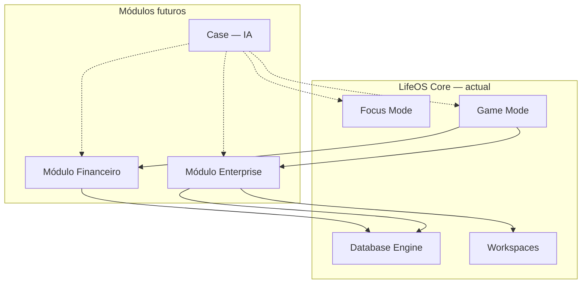

# LifeOS — Módulos futuros (visão)

**Estado:** planeamento · **sem implementação**  
**Última actualização:** 2026-05-30

Documento de referência para três evoluções de produto acordadas para o roadmap.  
Detalhe técnico e specs por módulo serão fechados antes de cada fase de desenvolvimento.

Relacionado: [`ROADMAP.md`](ROADMAP.md) · [`ESTADO-ATUAL.md`](ESTADO-ATUAL.md) · [`ARCHITECTURE.md`](ARCHITECTURE.md)

---

## Posição no ecossistema LifeOS

O LifeOS actual cobre **produtividade pessoal** (Focus Mode) e **progressão RPG** (Game Mode) sobre os mesmos dados (tarefas, hábitos, objectivos, clientes, estudos).

Os três módulos abaixo **expandem o sistema operacional pessoal** sem substituir o core:

| Camada | Papel |
|--------|--------|
| **Core** | Execução diária, dados, gamificação opcional |
| **Financeiro** | Gestão financeira **pessoal** do utilizador |
| **Enterprise** | Gestão de trabalho **em equipa / empresa** |
| **Case** | Assistente de IA transversal a toda a app |

---

## 1. Módulo Financeiro

**Desenho completo:** [`FINANCEIRO.md`](FINANCEIRO.md)

### Objetivo (actualizado)

Não é só gestão de contas — é **educação financeira prática** dentro do LifeOS: **métodos** guiados (50/30/20, fundo de emergência, etc.), rituais semanais, micro-lições e registo mínimo para **aprender a gerir dinheiro enquanto se gere**.

### Público

Utilizador individual (Focus / Game). Não confundir com contabilidade empresarial (Enterprise).

### Relação com o que já existe

| Actual | Evolução |
|--------|----------|
| Base **CLIENTS** | Receitas de freelancing; fecho → sugerir movimento |
| Atributo RPG **Finanças** | Comportamento (métodos, revisões, metas), não só deals |
| **Hábitos** / **GOALS** | Rituais e metas financeiras auto-sugeridos |
| **Case** | ✅ Coach financeiro contextual (chat + insights Agora) |

### Horizonte

**Fase F1** — ver fases F1.0–F1.3 em [`FINANCEIRO.md`](FINANCEIRO.md).

### Questões em aberto

Ver secção 13 de [`FINANCEIRO.md`](FINANCEIRO.md).

---

## 2. Módulo Enterprise

### Objetivo

Permitir **gestão de tarefas e projectos dentro de uma empresa**: equipas, permissões, visibilidade organizacional e fluxos de trabalho partilhados — mantendo a experiência LifeOS (bases de dados, kanban, foco).

### Público

Equipas e empresas (PM, ops, dev, agências). Utilizador pode ter **conta pessoal LifeOS** e **membroships empresariais**.

### Relação com o que já existe

| Actual | Evolução |
|--------|----------|
| `Workspace` + `WorkspaceMember` + roles | Base para «organização» |
| Templates TASKS, PROJECTS, GOALS | Bases partilhadas na org |
| Focus Mode individual | Vista «Minhas tarefas» + vista «Equipa» |
| Game Mode | Opcional por org (gamificação de equipa — fase posterior) |

### Escopo indicativo (a fechar)

**MVP conceitual**

- Entidade **Organização** (empresa) acima de workspaces
- Convites, roles org (Admin, Manager, Member)
- Workspaces de equipa com bases partilhadas
- Atribuição de tarefas a membros
- Dashboard de equipa: carga, atrasos, conclusões

**Fora do MVP inicial**

- SSO / SAML, SCIM
- Billing por lugar (SaaS)
- Game Mode competitivo entre equipas
- ERP / RH completo

### Dependências técnicas (prováveis)

- Modelo multi-tenant ou org-scoped (`Organization`, `OrganizationMember`)
- Isolamento de dados entre orgs
- UI Enterprise shell ou modo «Trabalho» (similar a Focus vs Game)
- Notificações in-app / email para atribuições

### Integração com módulos

- **Financeiro:** despesas de projecto ao nível org (fase posterior)
- **Case:** contexto de equipa («resume as tarefas em atraso da equipa X»)

### Horizonte

**Fase E1** — after Financeiro ou em paralelo se equipa dedicada.  
Impacto arquitectural **alto** — requer spec de tenancy e segurança antes de código.

### Questões em aberto

- [ ] Organização ≠ Workspace, ou workspace «tipo empresa»?
- [ ] Utilizador free mantém só pessoal; Enterprise é plano pago?
- [ ] Game Mode desactivado por default em contexto enterprise?

---

## 3. Case — Assistente de IA

**Estado:** C1 + C1+ v1 + **C2** entregues — detalhe em [`CASE.md`](CASE.md).

### Objetivo

**Case** é a IA integrada no LifeOS que auxilia o utilizador em **toda a aplicação**: planear o dia, criar hábitos e registos financeiros, interpretar dados, sugerir prioridades e explicar progressão RPG.

### Entregue (C1 → C2)

| Superfície | Estado |
|------------|--------|
| **Case Chat** | ✅ Focus, Game, Finanças — FAB hexagonal + painel |
| **Case Actions** | ✅ 5 acções com confirmação (parser PT-PT + LLM tools) |
| **Case Insights** | ✅ Widget no Painel Agora + API `/case/insights` |
| **Streaming SSE** | ✅ Respostas LLM token-a-token |
| **Case Actions (⌘K)** | ❌ C3 — paleta de comandos |
| **Case Coach Game** | 🔄 Parcial — contexto Game no chat; missões proactivas C3 |

### Princípios

| Princípio | Implicação |
|-----------|------------|
| **Contexto real** | Case lê dados autorizados do user (tarefas, hábitos, perfil game, finanças) — não inventa progresso |
| **Acção, não só chat** | Criar linha, marcar hábito, resumir semana — com confirmação do user |
| **Omnipresente mas não intrusiva** | Painel lateral, ⌘K, ou botão flutuante; nunca bloqueia Focus Mode |
| **Modo-consciente** | Tom e capacidades adaptadas a Focus vs Game vs (futuro) Finance vs Enterprise |
| **Privacidade** | Dados financeiros e enterprise com scopes explícitos; opt-in por módulo |

### Superfícies de produto

- **Case Chat** — ✅ conversa contextual por modo (Focus / Game / Finanças)
- **Case Actions** — ✅ acções com confirmação; ⌘K em C3
- **Case Insights** — ✅ resumos proactivos no dashboard «Agora»
- **Case Coach** — parcial via chat Game; dicas proactivas em C3

### Dependências técnicas

- ✅ Provider LLM (Groq/OpenAI) + `server/case/`
- ✅ Tool calling sobre API LifeOS (finanças, hábitos)
- ✅ Streaming SSE para UI
- ❌ Audit log persistente de acções propostas vs executadas
- ✅ Política de retenção (opt-in LLM, sessão efémera)

### Integração com módulos futuros

| Módulo | Exemplo de uso Case |
|--------|---------------------|
| Financeiro | «Quanto gastei em alimentação este mês?» |
| Enterprise | «Quem está bloqueado na sprint?» |
| Game Mode | «O que falta para subir de nível?» |

### Horizonte

**C1–C2** entregues. Próximo: **C3** (mais acções, Command Palette, insights LLM).

Ordem sugerida de **profundidade**: Case C3 → Enterprise → Case+Enterprise.

### Questões em aberto

- [x] Nome UI: «Case», ícone octaedro verde, FAB hexagonal
- [x] Modelo: Groq (recomendado) ou OpenAI via env
- [ ] Case no Game Mode com persona RPG dedicada vs tom neutro

---

## Mapa de fases sugerido (roadmap macro)

| Fase | Entrega | Notas |
|------|---------|--------|
| **Actual** | Core + RPG v1.1 + Loja + Finanças F1.3 + Case C2 | E2E, deploy |
| **F1** | Módulo Financeiro MVP | ✅ F1.0–F1.3 entregue |
| **C1** | Case MVP | ✅ Chat Focus + Game + Finanças |
| **C1+** | Case acções | ✅ 5 acções com confirmação |
| **C2** | Case insights + stream + LLM tools | ✅ Widget Agora, SSE, tool calling |
| **C3** | Case Command Palette + mais acções | Planeado |
| **E1** | Enterprise MVP | Org, equipas, atribuições |
| **E1+** | Case + Enterprise | Assistente de equipa |
| **v2+** | Open Banking, SSO, leaderboards, mobile | Backlog longo |

> **Nota:** F1 e C1–C2 estão entregues no código; este documento descreve visão futura (Enterprise, C3, v2+).

---

*Documento vivo — actualizado Maio 2026.*
